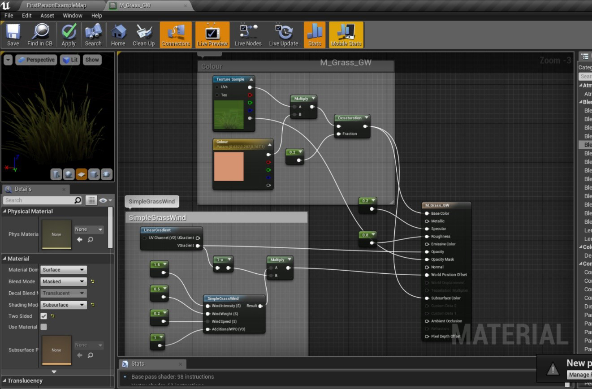
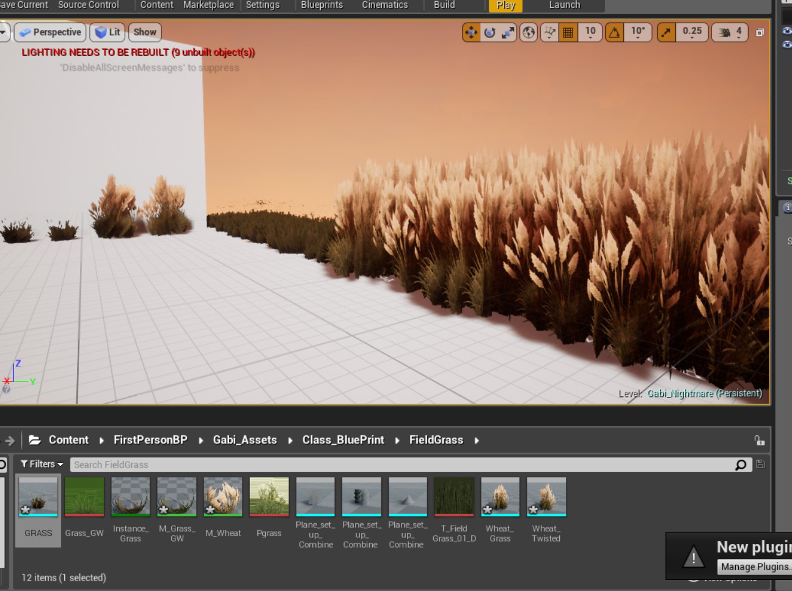

# Reveal_Stairway_Material_and_Documents

his a NEW Repository file that comes from the original Repository 'Reveal_Stairway'. 

This will only contain my BLOG, images and photoshop doucment. 

.......................................................................

This is my independent project for the collaboration of team ‘Break the Build’.
 We have been assigned to test and produce new effects and coding so that we may join together in the future to create our survival horror game.
IN MY GITHUB REPOSITORIES, look for ‘Break-the-Bill’ as that is our collaborative repository. You will see the list that we have come up with.

My assignment from the team from the last few weeks:

1.	Create animation for platforms to appear e.g. stairs appear before the player (level Blueprint, Matinee).
2.	Operate a key mechanic, door can only be open by a key (include widget text/images to pop up).

NOTICE 22/11/2017:
I’ve forgot to add my screenshot and videos from the last few projects a while ago, so go check them my repositories BluePrintLesson1 and ThirdPersonProject for those updates. 

1: Creating animation for stairs to appear before the player

Mood board (Pinterest): https://www.pinterest.co.uk/gabrielawoch100/break-the-build/
To check out my videos: Reveal_Stairway > Video Clips

Brief summary of my progress:

Blue Print and Matinee display highlighting the directional path for the floorboards

Video: [1, 2 and 3]
Soon realized after a couple of days of researching that I found out that there were many ways of how to make an object move, whether by the Boolean system that effects their location, so on and so forth. But what I found that appears to me the most the simplest to construct is to use the Matinee mechanic. Allowing to animate multiple object in one program. The only problem is, is that it has to be made in Level blueprint and so I have to reconstruct from scratch if I were to use this in another project. Also need to find ways to keep my layers clean as this takes a lot of induvial object to be inserted in.  
Had a problem when I first made it was made it, the trigger box got caught up with the animation. So I can’t make a ‘Reverse’ command if I wanted to. 

Video: [4 Stairway Animation fixed]
I figured out how to stop the trigger box from animating with the Matinee. By detaching the box that was an actual a component within the first starting object. I then recreated the box as a separate actor and join it back to the blueprint. See how clean and simple the blueprint looks with matinee?

Blueprint for the Matinee mechanic for the Stairs and Door

2: Creating a Door mechanic that can be opened up by a key 

Plus adding text that will help the player tell what they need to do or what they got.
Took a couple of days to research whether to make the opening door mechanic work on CLASS BLUEPRINT but the tutorials that I found was not very specific and didn’t use the First-person character. The blueprint inputs are very different between first and third person characters. So it for now, to make things easier I used the matinee system again and worked my way around that.

Inserting the ‘E’ key input into Blue print within the Matinee. Making the door opening door mechanic. I added the E input in the project setting.
This was before I added the Boolean variable for the key mechanic.

Had to set up the Boolean variables on my first person’s blueprint and then transfer them onto the LEVEL Blue Print.
I’d used a random jar object that I have made in the past to serve as the key. I added the collision effect and had to rearranged the trigger event input just to make the whole blueprint worked. 

With that working, I need to now tell the player how to operate it. So, a text display would be simple enough. I figured out that I can use widget for this part. 
As an artist I had experience with drawing out UI on Photoshop, but never had the chance to insert some in the game. If we want to make the game stylized and not just showing plain old text on screen, drawing the menu out would be a much more effective thing to see on the screen.

Playing around making UI display on photoshop, I added text within the box.

To see my drawn UI: Reveal_Stairway > Screenshots > Drawn_UI

Next step was trying to learning how to insert the UI images that I made into Unreal through Widget. I didn’t use text format for this experiment, just the image format along with its fading effects. 

Attempting to add the Widget into Blueprint.

The correct way to add the imaged text for telling the player to press ‘E’ when coming to the door was to separately open up the door’s trigger box on CLASS blue print and then added the widget set up there.

Blueprint of attaching the “Obtain Key” widget when you touched the key. It was very tricky to figure out how to destroy the key’s trigger box as well. Because before, you could just continue to walk over that spot and the text will still reappear after you first picked up the key.

Video: [21 Key Mechanic without Locked sign].
This was the last thing I achieved without coming back for a long time. Managed to get the widget ‘Press E’ to appear but can’t figure out how to get “It’s Locked” image to appear with the condition of pressing the ‘E’ input and without the key itself.
Video: [22 ‘It’s Locked’ Issue].
After spending over 3 hours on trying to figuring how to get the text to appear on the screen, the closet bit I got to which you can see it in the video, is to use the String Print, I initially tried to make a new variable that was set up only for the ‘E’ input to be the new condition for the branch/Boolean mechanic, but that didn’t work either. Overall the main issue was to address the computer which condition I’m trying to analyze, when things do work out, it unfortunately disables the other entire system of when the player does get the key and so you can’t open the door. For now, I can only leave for now and see if my fellow team mate might help figure the problem. 
Right now, I need to start my next plan or creating some bushes and hedges for the game.

3: Merging our separate object into one Unreal Project.
PROJECT IS NOW MOVED ONTO THE GROUP UNREAL PROJECT (Our_Nightmare)
To it keep it simple, we each made our level map to install all of the new things into the same Unreal project without colliding when committing our work.
Learnt to Migrate (transfer one blueprint/ asset to another project)
Issue encounter: 

•	Only Class blueprint can be transfer over to the new project. Meaning I had to start from scratch to add in new matinee and build up the level blueprint.
•	Images had to be reinstalled into the widget. 

Class Blueprint (trigger box) and project in the GROUP github (Our_Nightmare)

Video: [31 Same mechanic, different Project].
Decide again to leave the issue for now as it still keeps showing up the ‘lock’ sign despite whether the player got the key or not.

4: Creating and importing grass

Video: [Grass setup]. 
Separate Repoistory: https://github.com/gwoch/Making_Plants_Textures-Meshes.git (Unfortunately, I couldn't commit the updates in github beacuse I had few technical problem and the space as already ran of of data. Lost about 20 commits of my work, you are going have to rely on the screenshot that I taken in this README).

Initially I was going to create some hedges but with some confusion ended up trying to learn how to make some grass. It turns out to be a lot simpler to create the grass. With only using 4 plain shapes to make in Maya and a single texture image, the real work was applying them in the material setting. After following some tutorial online, I was amazed how much I’ve learnt within learning the special effect you can use. This I found a much better time learn how to use multiplier, linear gradient and wind effect. It will definitely help learning how to fix material import as I already had a bad experience when trying to get the texture looking the way I wanted in unreal engine.

Texture image I used to make the grass

If the object is twist in spiral, so will the material. It’s interesting to see if it will look better if all of were twist, could it cover more ground, or would it look more fake?

Material in the group project: Same material setting just different texture sample, look like I could make a wheat field if I wanted to.

5: Skybox and Lightening.

Sky Background (Still working progress)
Process of making the sky for the game. We agreed that we wanted the tone to be near nighttime/sunset setting. So I tried using the PostProcessVolume setting to create the setting (See the result above). However, this result affects the object too, so they become the colour as same as the lighting (that object in the image above was initially red and the lightening change it to be navy).

We use this image on the below as reference guide because we like how it’s look mystical whilst also implying the darkness feel to it.

Image reference that is available from: http://huaban.com/pins/470061355/ [Accessed 25th October 2017].

So, going back to the drawing board, I tried a new technique, making a SkyBox. It’s still a developing process as I had many complications where the flat image that I make on Photoshop either doesn’t align or inserting it into unreal make the whole image pixelated. It was also something I had to adapt because I started out with a cubemap and then had to convert it into a 360 panorama.
Obviously my first few attempt (Bottom image) doesn’t looks as appealing as our guide. My images look stretched and so I need to make my png image bigger to avoid the distorted image.

6: Switched Repository 

After some time, I have been having trouble committing any new thing into github both in the and in separate project which was only to play around with the plantation (https://github.com/gwoch/Making_Plants_Textures-Meshes.git)

After a few days working on the project, my original repository in github couldn’t afford the space to keep committing. I probably might have lost 30 commits since I couldn’t fix the issue sooner. Instead I had to RELOCATE the repository. Splitting the project up so one contains the unreal project and the other contain my images and files.

My Original Repository https://github.com/gwoch and https://github.com/gwoch/Reveal-stairway.git is now split up to…..

https://github.com/gwoch/Reveal_Stairway_Material_and_Documents.git /

https://github.com/gwoch/Reveal_Stairway_UR.git

Repository for Maya Modelling

https://github.com/gwoch/BTB-Iron-Gates.git 

https://github.com/gwoch/BTB-Spectacle-Lever-and-Lamp.git 

https://github.com/gwoch/BTB-Gnome.git

These would be the new repository for you to examine now…...

Our Game will be in here now:
https://github.com/luarsu/BreakTheBuildFINAL.git

In our FINAL PROJECT in Unreal engine. I would not be able to produce a lot of commits. As my role has been decide to become one of the main modeller and so my task is more focused outside the of the project, creating objects for the game and importing them after. So, all my commits of shown below and will only commit in the Final project once I have some finished asset to import.

7: Fixing the Skybox

After digging my way to find the solution, it eventually came to the point where I had to manually manipulate the flat image. I started trying to build it on a cubemap which became very complicated and trying to convert it into a 360 panorama online. However the image shown below show the result of the image, making the entire sky look very square shaped.

I then tested the image on the skybox (which the actor was picked to be a sphere) as I initial started before I shaped it. This result was more promising but still needs more tweeting.

PNG Image

What it looked in Unreal Engine. (the reason this was showing the coloured to be very light was because the image I imported wasn’t a 8bit format and so unreal engine was not compatible to allow me to activate sRGB settings). You can see the top of the image being clamped together, so this has given me an indicate of where I should stretch the image. 

Overall by long trail and error I decide to manually recreated the scene on photoshop and morph the shape by hand using a sphere UV map as reference. Converting the image in a skybox setting in unreal and simply apply it in the material box. Honestly this shaping took 10 attempts to make it work. Check out my folder 'Image Import' to see the multiple images of attempt of making the image.

Material Setup.

Image Setup.

End result.

8: Modelling.

Because I have taken role as the game modeller and in charge for other artistic purpose. I recommend checking out Micheal’s google slide as it will contain all of my work that based on modelling the objects for the game. I’ll show you some preview screenshots. My commits at this point will bw on the Maya sofwtare and possible back on my independented unreal project.

I made these gates that will the maze main doors, this will have animation and some will be trigger by a switch or a key.

9:
